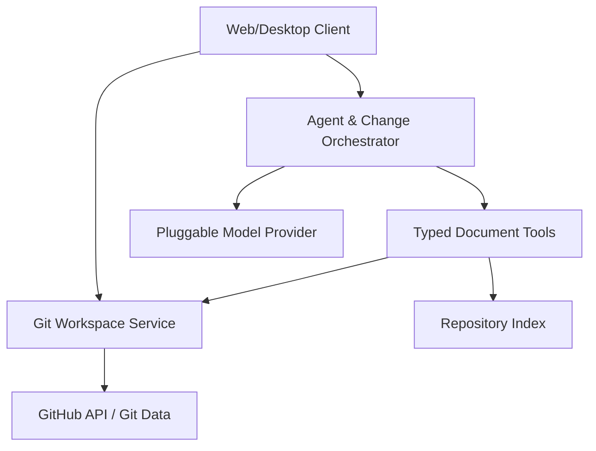

# Agent-First Git Documentation Engine

**Working title:** AgentDocs  
**Document type:** Product and technical specification  
**Status:** Draft v0.1  
**Date:** July 10, 2026

## 1. Executive summary

AgentDocs is an open-source, agent-first documentation workspace built directly on existing GitHub repositories. It gives teams a Google Docs–like editing experience while preserving Markdown files, Git commits, branches, pull requests, and repository permissions as the source of truth.

The product is not a new document store with a Git export feature. It is a specialized Git client, Markdown editor, and agent runtime. A user connects an existing repository, selects one or more documentation roots, and immediately works against those files. Manual edits and agent edits use the same change model: each produces an inspectable diff, an attribution trail, and either a direct commit or pull request according to repository policy.

The core interaction is not “open a blank page and type.” It is “state an intent, let an agent inspect the relevant repository context, and review a proposed documentation change.” The editor remains first-class for corrections, detailed writing, and collaborative review.

### Product thesis

1. Documentation should live beside the systems it describes.
2. GitHub should remain the canonical store for content, identity, permissions, and history.
3. Agents should operate through constrained, auditable document tools—not unrestricted repository mutation.
4. Every generated claim should be traceable to evidence or explicitly marked as an assumption.
5. Human edits and agent edits should converge on the same Markdown and Git workflow.

## 2. Goals and non-goals

### Goals

- Connect to an existing GitHub repository without migrating content to a proprietary database.
- Provide a polished WYSIWYG and Markdown editing experience for `.md` and `.mdx` files.
- Make prompting, planning, reviewing, and applying agent changes the primary workflow.
- Let agents read documentation plus approved repository context such as source code, schemas, API specs, issues, and recent diffs.
- Produce deterministic file patches, previewable rendered output, and attributable Git commits.
- Respect branch protection, CODEOWNERS, required reviews, and GitHub App permissions.
- Support local-first and self-hosted deployment paths.
- Keep the core format portable: a user can stop using AgentDocs and retain ordinary Markdown in Git.

### Non-goals for v1

- Replacing GitHub as an identity provider, permission system, or durable content store.
- Full Google Docs parity, especially character-by-character multiplayer editing.
- Arbitrary autonomous code changes.
- A general-purpose project-management system.
- A proprietary page format that requires AgentDocs to render.
- Training models on customer repository content.
- Supporting every Git provider in the first release.

## 3. Primary users and jobs

| Persona | Primary job |
| --- | --- |
| Engineer | Explain or update a system without manually reconstructing context from code. |
| Product/engineering lead | Create plans, RFCs, decision records, and launch docs with agent assistance. |
| Technical writer | Restructure, normalize, and review documentation across a repository. |
| Maintainer | Enforce templates, evidence, ownership, freshness, and review policy. |
| Agent or CI workflow | Propose documentation updates when code, schemas, or product behavior changes. |

### Critical workflows

1. **Create from intent:** “Draft an RFC for adding tenant-level audit exports using the existing architecture and RFC template.”
2. **Update from change:** “Update the API guide for the changes in PR #418.”
3. **Transform:** “Make this page shorter, preserve all requirements, and move operational details into a runbook.”
4. **Answer then edit:** Ask a repository-grounded question, then convert the answer into a durable documentation patch.
5. **Review:** Explain what changed, identify unsupported claims, and approve selected hunks.
6. **Maintenance:** Detect stale pages, broken links, undocumented public APIs, and inconsistent terminology.

## 4. Product principles

### Git is the source of truth

The canonical document is the blob in the configured repository and branch. The service may maintain disposable caches for search indexes, embeddings, rendered previews, and active sessions, but those are reconstructable. It must never require a separate server-side document record to recover the latest content.

### Propose before mutate

Agents default to a proposal state. They return a plan, evidence, affected files, and a patch. Mutation requires an explicit user action or a repository policy that authorizes a narrow automation.

### Evidence is a product primitive

Agent output should distinguish:

- repository-backed claims with file, symbol, issue, PR, or commit references;
- user-provided facts;
- external facts, if external retrieval is enabled; and
- assumptions or recommendations.

Evidence metadata is stored in the change session and may optionally be serialized into Markdown footnotes or frontmatter.

### Progressive disclosure

The default interface should feel simpler than Git. Users see documents, prompts, suggested edits, and review controls. Branches, commits, merge conflicts, and raw Markdown remain available when needed.

### Portability over magic

AgentDocs-specific metadata belongs in optional YAML frontmatter, sidecar files under `.agentdocs/`, Git notes, commit metadata, or GitHub checks. A standard Markdown renderer should still produce a useful document.

## 5. Product surface

### 5.1 Repository onboarding

- Install a GitHub App on selected repositories.
- Select a default branch and one or more documentation roots such as `/docs`, `/rfcs`, or the repository root.
- Discover Markdown/MDX files, navigation configuration, templates, CODEOWNERS, and repository instructions.
- Optionally create `.agentdocs/config.yml` through a pull request.
- Build a repository index with explicit progress and freshness status.

Example configuration:

```yaml
version: 1
docs_roots:
  - docs
  - rfcs
default_write_mode: pull_request
rendering:
  flavor: gfm
  mdx: true
agents:
  context_roots:
    - src
    - openapi
  external_web: false
policies:
  require_evidence: true
  max_files_per_change: 20
  protected_paths:
    - docs/security/**
templates:
  rfc: .agentdocs/templates/rfc.md
  runbook: .agentdocs/templates/runbook.md
```

### 5.2 Workspace

- Repository and branch selector.
- Document tree with search, status, ownership, and freshness indicators.
- Center editor with rich-text, split, and source modes.
- Agent panel scoped to the open document, selection, directory, PR, or repository.
- Review drawer containing plan, evidence, warnings, rendered preview, and file diff.
- Presence and advisory locking for active editing sessions.

### 5.3 Editor

MVP editing features:

- headings, paragraphs, emphasis, links, lists, tables, blockquotes, code blocks, task lists, images, and frontmatter;
- slash commands and reusable templates;
- syntax-safe Markdown serialization with minimal diff churn;
- live rendered preview using repository-aware links and assets;
- manual save to a draft change set rather than immediately committing every keystroke;
- keyboard-first accept/reject for agent suggestions;
- comments anchored to a block or diff hunk, stored initially in the application session or GitHub PR review.

MDX support should begin in a safe mode: preserve unknown JSX nodes and allow source editing, but only visually edit a known component allowlist.

### 5.4 Agent interaction

The agent composer accepts natural-language intent plus optional controls:

- scope: selection, current document, folder, repository, issue, or pull request;
- operation: create, revise, restructure, summarize, review, or synchronize;
- context budget and approved context roots;
- template and target audience;
- write mode: suggest only, create branch, open PR, or commit directly if permitted.

An agent run has five visible stages:

1. **Understand:** restate the goal and constraints.
2. **Retrieve:** collect relevant documents, code symbols, history, and linked artifacts.
3. **Plan:** list target files and intended edits.
4. **Propose:** produce structured patches plus evidence and warnings.
5. **Apply:** after approval, write to the working branch and optionally open a PR.

Users can approve the whole change, individual files, or individual hunks. Manual edits made during review are incorporated into the same change set.

### 5.5 Versioning and review

- Direct commit, new branch, and pull-request modes.
- Human-readable commit message generated from the accepted patch and editable before submission.
- Commit trailers for agent/model/run attribution without polluting document content.
- Side-by-side Markdown diff, semantic block diff, and rendered diff.
- GitHub checks for Markdown lint, links, policy, and evidence coverage.
- Conflict UI that shows base, repository head, and local/agent proposal.
- Restore or branch from any historical commit.

## 6. High-level architecture



### 6.1 Client

Recommended stack: TypeScript, React, and a ProseMirror-based editor such as TipTap. Use a canonical Markdown abstract syntax tree (MDAST-compatible) between the source parser and editor model. The client owns interaction state, selection scope, local drafts, diff review, and previews.

For local-first use, package the same client in a desktop shell or run it against a local companion daemon. Browser-only deployment can use an ephemeral server-side workspace.

### 6.2 API and orchestration service

Responsibilities:

- GitHub App installation and user authorization;
- repository/branch discovery;
- session and change-set lifecycle;
- agent planning and tool execution;
- streaming progress and patches;
- policy evaluation;
- commit/branch/PR operations;
- webhook processing and cache invalidation.

The service should be stateless with respect to canonical documents. Durable operational records may include encrypted installation tokens, run audit metadata, policy decisions, and job state. Content caches should have defined retention and deletion controls.

### 6.3 Git workspace service

This component creates an isolated workspace for each active change set.

Preferred implementation:

- use GitHub Git Data/Contents APIs for small reads and atomic commits in the hosted MVP;
- use shallow or partial clones for large repositories, multi-file merges, local deployment, and advanced Git operations;
- pin every change set to a base commit SHA;
- write accepted patches to an isolated worktree or in-memory tree;
- rebase or perform a three-way merge before publishing if the target branch moved;
- never force-push by default.

The abstraction must expose the same operations regardless of API-backed or clone-backed implementation.

### 6.4 Repository index

The index is derived, disposable state. It supports lexical, structural, and semantic retrieval.

Index units:

- Markdown headings and blocks;
- code symbols and docstrings via tree-sitter or language servers;
- OpenAPI/AsyncAPI/GraphQL/protobuf schema elements;
- file paths, ownership, links, and frontmatter;
- commits and diffs within a configured window;
- GitHub issues and pull requests when enabled.

Each indexed unit stores repository, commit SHA, path, byte/line range, content hash, language/type, and access scope. Retrieval results must be pinned to a commit so evidence does not silently change during a run.

Start with SQLite/Postgres full-text search plus embeddings through a pluggable vector interface. Do not make embeddings mandatory for correctness.

### 6.5 Agent runtime

The runtime is model-provider agnostic and executes agents through typed tools:

```text
search_repository(query, scope, commit_sha)
read_file(path, commit_sha, range?)
read_symbol(path, symbol, commit_sha)
read_history(path, limit)
read_pull_request(number)
render_markdown(files, config)
validate_links(files)
propose_patch(base_sha, operations[])
```

Write tools produce a `ChangeProposal`; they do not directly push. The orchestrator validates path scope, file count, patch size, protected paths, and base SHA before exposing the proposal to the user.

Agent execution should use a planner/executor pattern but avoid an elaborate multi-agent framework initially. A single capable agent with explicit tools, checkpoints, and validators is easier to audit and debug. Specialized reviewers—factuality, style, link validation—can run as deterministic checks or optional secondary passes.

### 6.6 Rendering and validation

- Parse with a CommonMark/GFM-compatible pipeline.
- Support repository-specific plugins behind an allowlist.
- Render untrusted HTML/MDX in a sandbox with scripts disabled by default.
- Validate syntax, internal anchors, relative links, assets, frontmatter schemas, and configured style rules.
- Generate a rendered-before/rendered-after artifact for review.

### 6.7 Extensibility

Expose three extension surfaces:

1. `.agentdocs/config.yml` for repository policy and conventions.
2. Markdown templates and instruction files committed in the repository.
3. An MCP-compatible server exposing read-only and proposal-oriented documentation tools to external agents.

External agents should receive proposal capabilities, not raw push credentials.

## 7. Core domain model

| Entity | Purpose | Durable location |
| --- | --- | --- |
| RepositoryBinding | GitHub installation, repository, default branch, config path | Operational database |
| Workspace | User session pinned to repository and base SHA | Ephemeral/cache |
| Document | Parsed view of a Markdown/MDX blob | Git repository |
| ChangeSet | Collection of manual and agent changes against one base SHA | Session store; finalized in Git |
| ChangeProposal | Typed file operations, patch, evidence, warnings, validation results | Audit/session store |
| AgentRun | Intent, context references, tool trace, model metadata, status | Audit store with retention controls |
| EvidenceRef | Immutable reference to path/range/symbol/PR at a commit SHA | Change proposal or optional sidecar |
| Policy | Limits and approval rules | Repository config plus org defaults |

### Change proposal schema

```json
{
  "baseSha": "abc123",
  "intent": "Update API authentication guide for PR #418",
  "operations": [
    {
      "type": "modify",
      "path": "docs/api/authentication.md",
      "patch": "...unified diff..."
    }
  ],
  "evidence": [
    {
      "claimId": "claim-7",
      "source": "src/auth/token.ts",
      "commitSha": "abc123",
      "startLine": 41,
      "endLine": 68
    }
  ],
  "warnings": [],
  "validation": {
    "markdown": "passed",
    "links": "passed",
    "policy": "passed"
  }
}
```

## 8. Key technical flows

### Open and edit a document

1. Resolve repository, branch, and head SHA.
2. Fetch the blob and repository rendering configuration.
3. Parse Markdown into a source-preserving syntax tree.
4. Map supported nodes into the rich editor while preserving unsupported nodes.
5. Save edits into a local change set.
6. Serialize with minimal formatting churn and validate.
7. On publish, verify the base SHA and create a commit or PR.

### Agent-generated update

1. Create a run pinned to the workspace base SHA.
2. Interpret intent and build a retrieval plan.
3. Retrieve only authorized context; retain immutable evidence refs.
4. Produce a file-level plan for user visibility.
5. Generate typed file operations and unified patches.
6. Parse and render the result; run deterministic validators.
7. Show semantic and rendered diffs.
8. Apply approved hunks to the same change set as manual edits.
9. Reconcile against current repository head and publish.

### Concurrent update and merge

If repository head changes after the workspace is created:

- if changed files do not overlap, rebase automatically and rerun validation;
- if textual changes overlap but resolve cleanly through a three-way merge, show the merged diff;
- otherwise require explicit conflict resolution;
- after any rebase, invalidate evidence for changed source ranges and rerun affected agent checks.

## 9. Security, privacy, and trust

- Use a GitHub App with least-privilege, repository-scoped permissions.
- Keep installation tokens server-side, encrypted, short-lived, and never exposed to the model.
- Enforce authorization on every retrieval and write tool call, not only at UI entry.
- Treat repository text as untrusted prompt input; isolate it from system instructions and flag prompt-injection patterns.
- Default external network access to off during repository-grounded runs.
- Allow configurable model providers, data residency, retention, and self-hosted inference.
- Redact secrets before model context using established secret scanners and repository-specific patterns.
- Sandbox Markdown/MDX rendering and prohibit arbitrary plugin execution in hosted mode.
- Maintain an audit record of user intent, context references, tool calls, approvals, resulting commit, and model/provider metadata.
- Never merge or bypass branch protection; rely on GitHub’s native enforcement.

## 10. API outline

```text
GET    /v1/installations
GET    /v1/repos/{owner}/{repo}/tree?ref={sha}&root={path}
GET    /v1/repos/{owner}/{repo}/files/{path}?ref={sha}
POST   /v1/workspaces
PATCH  /v1/workspaces/{id}/files/{path}
POST   /v1/workspaces/{id}/agent-runs
GET    /v1/agent-runs/{id}/events
POST   /v1/change-sets/{id}/validate
POST   /v1/change-sets/{id}/publish
POST   /v1/change-sets/{id}/reconcile
```

Use server-sent events for agent progress in the MVP. Use idempotency keys on agent-run and publish endpoints. Every mutating request includes the expected base SHA.

## 11. Feature plan

### Phase 0 — Technical spike (2–3 weeks)

**Goal:** Prove loss-minimized Markdown editing and safe Git publication.

- Connect one repository through a GitHub App.
- Open a Markdown file at a pinned SHA.
- Round-trip common Markdown through a ProseMirror editor without noisy diffs.
- Prompt an LLM with selected repository files and generate a unified patch.
- Preview, accept, commit to a branch, and open a PR.
- Render before/after output and detect merge conflicts.

**Exit criteria:** A maintainer can update an existing page through an agent, manually correct it, and open a clean PR with no hidden document store.

### Phase 1 — Private alpha (6–8 weeks)

**Goal:** Complete the single-user, agent-first repository workflow.

- Repository onboarding and `.agentdocs/config.yml`.
- Document tree, search, rich/source/split editor modes.
- Agent create, revise, review, and update-from-PR workflows.
- Lexical + structural index; optional embeddings.
- File/hunk approval, evidence panel, validation, and rendered diff.
- Branch and PR publishing with CODEOWNERS awareness.
- Markdown lint, link checking, frontmatter validation.
- Agent audit trail and provider abstraction.
- Docker Compose self-hosting path.

**Exit criteria:** 5–10 design partners use it weekly on real repositories; at least 70% of accepted agent changes require only localized edits; no content-loss incidents.

### Phase 2 — Public beta (8–12 weeks)

**Goal:** Make it credible for team workflows and open-source adoption.

- GitHub OAuth user attribution in addition to App installation.
- Shared workspaces, presence, advisory locks, and PR-backed comments.
- Stale-document and undocumented-change detection via webhooks/CI.
- Templates for RFCs, ADRs, runbooks, API docs, and launch plans.
- Repository instruction hierarchy and protected-path policies.
- MDX safe mode and configurable component allowlist.
- MCP server for external agents.
- Extension SDK for validators and context adapters.
- Observability dashboard for latency, token use, acceptance, and failures.

**Exit criteria:** Reliable across repositories with 10,000+ documents; clear security documentation; one-command local deployment; repeat contributors outside the founding team.

### Phase 3 — Team-grade v1

**Goal:** Become the default interface for maintaining Git-backed knowledge.

- Block-level comments and stronger collaborative editing.
- Scheduled maintenance agents with approval queues.
- Cross-repository knowledge spaces with permission-aware retrieval.
- GitLab support through the Git provider abstraction.
- Documentation impact checks for code PRs.
- Analytics for freshness, coverage, ownership, and agent acceptance.
- Enterprise controls: SSO integration, retention policies, model allowlists, and audit export.

### Explicitly defer

- Fully autonomous merges.
- General code-generation agents.
- Pixel-perfect imports from Google Docs or Notion.
- Native binary-office document editing.
- Character-level CRDT collaboration before demand is proven.

## 12. Prioritized MVP backlog

| Priority | Capability | Why it matters |
| --- | --- | --- |
| P0 | GitHub App connection and repo browser | Establishes existing GitHub repos as the system of record. |
| P0 | Markdown source-preserving editor | Prevents the rich editor from damaging or reformatting files. |
| P0 | Agent proposal with scoped repository retrieval | Delivers the core product thesis. |
| P0 | Diff, evidence, accept/reject, commit, and PR | Makes agent work trustworthy and usable. |
| P0 | Base-SHA checks and conflict handling | Prevents lost updates. |
| P0 | Markdown/render/link validation | Protects repository quality. |
| P1 | Templates and repository instructions | Produces repeatable outputs. |
| P1 | Update-from-PR workflow | Creates a compelling recurring use case. |
| P1 | Search/index freshness via webhooks | Improves grounding and speed. |
| P1 | Docker self-hosting | Matches open-source and sensitive-repository expectations. |
| P2 | Shared live sessions | Useful, but Git/PR collaboration covers the initial need. |
| P2 | MDX visual components | Important for docs sites but technically risky. |

## 13. Success metrics

### North-star metric

**Accepted documentation changes per weekly active repository.** An accepted change is a manual or agent-assisted change published through AgentDocs and merged or committed successfully.

### Supporting metrics

- time from intent to PR;
- percentage of agent proposals accepted by file and hunk;
- percentage accepted without major rewrite;
- evidence coverage for factual claims;
- merge-conflict and failed-publish rates;
- Markdown round-trip diff noise;
- validation failures caught before PR;
- weekly active repositories and returning authors;
- stale-document issues resolved;
- model cost and latency per accepted change.

Initial targets for alpha:

- under 60 seconds to first useful proposal for a scoped update;
- under 1% non-semantic round-trip changes on the Markdown compatibility corpus;
- under 2% failed publish attempts excluding permission/branch-policy failures;
- over 70% of accepted proposals needing only localized human edits.

## 14. Testing strategy

- **Golden corpus:** Markdown fixtures covering GFM, frontmatter, nested lists, tables, HTML, diagrams, directives, footnotes, and MDX preservation.
- **Round-trip tests:** parse → edit/no-op → serialize must preserve semantics and minimize byte changes.
- **Property tests:** generated Markdown should never cause parser crashes or silent node loss.
- **Git integration tests:** stale SHAs, rebases, rename/delete collisions, protected branches, and partial hunk acceptance.
- **Agent evaluations:** groundedness, evidence precision, correct file selection, instruction adherence, and unsupported-claim rate.
- **Security tests:** prompt injection in repository files, path traversal, secret leakage, XSS in renderers, and authorization boundary checks.
- **End-to-end tests:** connect repo → edit/prompt → review → PR → webhook reindex.

## 15. Major risks and mitigations

| Risk | Mitigation |
| --- | --- |
| Rich editor rewrites Markdown and creates noisy diffs | Use a source-preserving AST, maintain a compatibility corpus, preserve unsupported syntax as opaque nodes, and always offer source mode. |
| Agents hallucinate behavior | Pin retrieval to commits, require evidence, separate assumptions, and run deterministic checks. |
| Large repositories create slow/expensive context | Use hierarchical retrieval, code-symbol indexing, explicit scopes, caching, and context budgets. |
| Git concepts overwhelm non-engineers | Present drafts and reviews first; reveal branch/commit details progressively. |
| Simultaneous edits cause conflicts | Pin base SHAs, use advisory locks, auto-rebase non-overlapping changes, and provide three-way resolution. |
| Repository prompt injection influences agents | Treat content as data, enforce tool authorization outside the model, scan instructions, and isolate external access. |
| Open-source project depends on hosted infrastructure | Keep provider interfaces pluggable and ship a reproducible self-hosted stack. |
| Product becomes a generic chat wrapper | Center the UX on durable changes, evidence, rendered diffs, and Git-native completion. |

## 16. Recommended implementation shape

Use a TypeScript monorepo:

```text
apps/
  web/                 # React application
  api/                 # API, auth, webhooks, orchestration
  worker/              # indexing, rendering, validation jobs
packages/
  markdown-core/       # parser, AST, serializer, source maps
  editor/              # ProseMirror schema and commands
  git-provider/        # provider-neutral Git operations
  github-provider/     # GitHub App/API implementation
  agent-runtime/       # tools, policies, run state machine
  retrieval/           # lexical, structural, semantic indexing
  change-model/        # patches, evidence, validation schemas
  renderer/            # safe GFM/MDX preview
  config/              # .agentdocs schema and resolution
  ui/                  # shared components
```

Suggested infrastructure for the hosted reference implementation:

- Postgres for operational metadata, jobs, and full-text search;
- an object store only for disposable render artifacts and oversized run logs;
- Redis or a Postgres-backed queue for short-lived jobs;
- isolated workers for repository indexing and rendering;
- optional vector extension/provider;
- OpenTelemetry for tracing agent runs, retrieval, and publishing.

Avoid Kubernetes in the initial reference deployment. A web service, worker, Postgres, and optional Redis should run locally with Docker Compose.

## 17. Open product decisions

1. Should the default hosted write path use GitHub’s Git Data API or ephemeral partial clones? Recommendation: API for simple MVP changes, behind a shared abstraction that permits clone-backed operations.
2. Should every agent change open a PR? Recommendation: PR by default; allow direct commits only on unprotected branches and with explicit repository policy.
3. Where should unresolved comments live before a PR exists? Recommendation: ephemeral change-set state in alpha, with an option to publish early as a draft PR.
4. How much agent metadata belongs in Git? Recommendation: concise commit trailers plus an optional `.agentdocs/runs/` sidecar mode; keep full traces out of the repository by default.
5. Is live collaboration required for v1? Recommendation: presence and advisory locks first; defer CRDT complexity until usage proves it necessary.
6. Should external sources be available? Recommendation: disabled by default and clearly separated from repository evidence when enabled.

## 18. Definition of MVP complete

The MVP is complete when a user can install the app on an existing GitHub repository, open any supported Markdown document, ask an agent to create or revise content using repository-grounded context, inspect the plan/evidence/rendered diff, manually adjust or partially accept the result, and publish a clean branch or pull request—without the canonical document ever leaving Git as its system of record.
